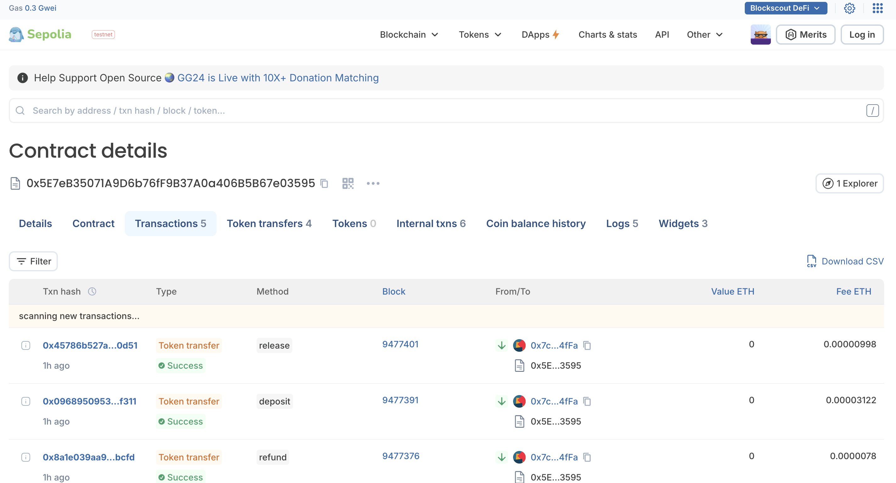

# SafeSend – PYUSD Consumer Protection On-Chain

<p align="center">
  
</p>

> Bringing PayPal-like consumer protection to on-chain stablecoin payments using fraud oracles and transparent smart contracts.

## The Problem

Traditional payment systems on Web2 offer robust buyer protection and fraud detection, but can often come with high fees (2-3% per transaction) and centralized control. Meanwhile, Web3 payments offer low costs and transparency but lack consumer protection—once you send crypto, it's gone. Users are left choosing between safety and cost-efficiency.

**SafeSend** is a decentralized escrow platform built on Ethereum that combines the security of traditional payment processors with the low-cost transparency of blockchain technology. By using PYUSD (PayPal's regulated stablecoin) and a modular fraud oracle architecture, SafeSend enables:

Prototype built for the EthOnline 2025 hackathon.

Demo url: https://usesafesend.vercel.app/ (deployed on testnet)

<!-- Demo video:  -->

**🛡️ Enterprise-Grade Fraud Protection at Blockchain Costs**
- Real-time fraud detection during every transaction
- Automatic buyer refunds when fraud is detected
- No 2-3% payment processing fees—just gas costs

**🔄 Evolving Security Without Contract Redeployment**
- Fraud detection algorithm lives in a separate, upgradeable oracle contract
- New fraud patterns can be detected by simply updating the oracle
- SafeSendContract remains immutable while security evolves
- Oracle maintained by specialized fraud detection authorities

**💰 Cost-Effective Fraud Prevention**
- One-time oracle consultation per escrow (~$0.50-2 in gas)
- Compare to: 2-3% fee on a $1,000 transaction = $20-30
- Significant cost reduction while maintaining security

**⚖️ Transparent Trust Model**
- Oracle address publicly viewable and verifiable
- All fraud decisions logged on-chain with reasons
- Users choose which oracle-enabled contracts to trust
- No black-box algorithms or arbitrary account freezes

## How It Works

SafeSend uses a **modular oracle pattern** where the payment escrow contract (SafeSendContract) consults an external fraud detection oracle (SimpleFraudOracle) through a standardized interface (IFraudOracle). This architectural separation enables:

1. **Immutable Payment Logic** - Core escrow contract never needs updates
2. **Evolving Fraud Detection** - Oracle can be upgraded as new threats emerge
3. **Specialized Expertise** - Fraud detection maintained by security specialists
4. **User Choice** - Different oracles for different risk tolerances
5. **Cost Efficiency** - Single oracle call replaces expensive off-chain verification

The oracle evaluates transactions against blacklists, amount limits, behavioral patterns, and manual flags—returning a simple pass/fail decision. Flagged transactions are automatically refunded, protecting buyers without manual dispute resolution.

Example contract transactions: https://eth-sepolia.blockscout.com/address/0x5E7eB35071A9D6b76fF9B37A0a406B5B67e03595?tab=txs

## System Architecture & User Flow

```
┌──────────────────────────────────────────────────────────────────────┐
│                       SAFESEND ARCHITECTURE                           │
└──────────────────────────────────────────────────────────────────────┘

                     ┌─────────────────────┐
                     │       USER          │
                     │  (Buyer / Seller)   │
                     └──────────┬──────────┘
                                │
                                │ Connect Wallet
                                │ Create/Manage Escrows
                                ▼
              ┌──────────────────────────────────────┐
              │     NEXT.JS WEB APPLICATION          │
              │  ┌────────────────────────────────┐  │
              │  │  • Create Escrow Form          │  │
              │  │  • My Escrows Dashboard        │  │
              │  │  • Escrow Details & Actions    │  │
              │  └────────────────────────────────┘  │
              │                                       │
              │  ┌────────────────────────────────┐  │
              │  │  Viem + Dynamic SDK            │  │
              │  │  (Wallet Integration Layer)    │  │
              │  └────────────────────────────────┘  │
              └───────────────┬───────────────────────┘
                              │
                              │ Transaction Signing
                              │ Contract Interactions
                              ▼
┌─────────────────────────────────────────────────────────────────────┐
│                   ETHEREUM BLOCKCHAIN (Sepolia)                      │
│                                                                       │
│  ┌──────────────────┐         ┌─────────────────────────────────┐  │
│  │  PYUSD TOKEN     │────────▶│    SAFESENDCONTRACT.SOL         │  │
│  │  (ERC-20)        │ approve │                                 │  │
│  │                  │ transfer│  • deposit() - Create Escrow    │  │
│  └──────────────────┘         │  • release() - Complete Payment │  │
│                                │  • refund() - Cancel & Refund   │  │
│                                │  • markFraud() - Flag Fraud     │  │
│                                └────────┬────────────────────────┘  │
│                                         │                            │
│                                         │ Oracle Fraud Check         │
│                                         │ (via IFraudOracle)         │
│                                         ▼                            │
│                                ┌─────────────────────────────────┐  │
│                                │  SIMPLEFRAUDORACLE.SOL          │  │
│                                │  (Modular & Upgradeable)        │  │
│                                │                                 │  │
│                                │  • checkEscrow()                │  │
│                                │  • Blacklist Management         │  │
│                                │  • Transaction Limits           │  │
│                                │  • Manual Fraud Flagging        │  │
│                                │                                 │  │
│                                │  ⚠️  Maintained by External     │  │
│                                │     Authority - Swappable       │  │
│                                └─────────────────────────────────┘  │
└─────────────────────────────────────────────────────────────────────┘
                              │
                              │ Event Emission
                              │ (Deposited, Released, Refunded, etc.)
                              ▼
              ┌──────────────────────────────────────┐
              │   BLOCKSCOUT EXPLORER & SDK          │
              │                                       │
              │  • Real-time Transaction Monitoring  │
              │  • Event Logs & Audit Trail          │
              │  • Public Oracle Verification        │
              └──────────────────────────────────────┘

═══════════════════════════════════════════════════════════════════════
KEY ARCHITECTURAL PRINCIPLES
═══════════════════════════════════════════════════════════════════════

🔌 MODULAR ORACLE DESIGN
   → Oracle implements IFraudOracle interface for standardization
   → Can be swapped without redeploying main payment contract
   → Maintained independently by fraud detection specialists

```

---

## Features

* **PYUSD Escrow** – Secure smart contract holds buyer funds until completion
* **Automated Fraud Detection** – Real-time checks with automatic refunds for flagged transactions
* **Buyer Protection** – Release funds or request refunds with transparent on-chain status
* **Blockscout SDK Integration** – Real-time transaction monitoring and explorer integration
* **Multi-Wallet Support** – Dynamic wallet connection (MetaMask, Coinbase, WalletConnect, etc.)
* **Complete Audit Trail** – All actions emit on-chain events viewable on explorers

---

## Tech Stack

**Frontend:** Next.js 14, Ant Design, Viem, Dynamic Wallet SDK, Blockscout App SDK

**Smart Contracts:** Solidity ^0.8.28, Hardhat, OpenZeppelin, Hardhat Ignition

**Blockchain:** PYUSD Token (Mainnet: `0x6c3...0e8`, Sepolia: `0xCaC...bB9`), Ethereum Mainnet & Sepolia Testnet

## Sponsors

SafeSend is built around three key partner technologies: PYUSD, Hardhat, and Blockscout.

PYUSD – PayPal’s regulated stablecoin serves as the payment rail. Because it’s fully ERC-20 compatible and backed by real-world reserves, it provides the reliability and consumer confidence needed for escrow-based payments. All transfers and refunds in SafeSend use PYUSD, ensuring predictable settlement and fiat equivalence.

Hardhat – Used for contract development, deployment, and verification. Hardhat’s scripting and testing environment made it possible to quickly simulate multiple fraud scenarios, verify contracts on testnets, and emit events compatible with explorer indexing.

Blockscout – Integrated as both a transparency layer and developer tool using the official Blockscout SDK (@blockscout/app-sdk). Every SafeSend action (deposit, fraud attestation, refund, release) emits an event visible through Blockscout's explorer and SDK, making the entire fraud arbitration process publicly auditable.

**Blockscout SDK Integration Features:**
- **Real-time Transaction Notifications** – Toast notifications with pending/success/error states appear instantly for all escrow operations (create, release, refund, fraud marking)
- **Transaction History Popups** – Interactive popups allow users to view complete transaction history for contracts, wallet addresses, and PYUSD token transfers
- **Contract Activity Monitoring** – Dedicated buttons throughout the app to view SafeSend contract transactions in real-time
- **PYUSD Transaction Tracking** – Direct access to PYUSD token transaction history via integrated explorer

The contract is written in Solidity, deployed on Ethereum testnets, and uses a single shared escrow logic that supports multiple businesses. Each business registers its own oracle for fraud attestations, allowing scalable participation without redeploying new contracts.

In essence, SafeSend combines on-chain logic, stablecoin security, and open attestations to create a trust-minimized consumer protection system for digital payments — bringing Web2-style confidence into the Web3 economy.

<!-- 1. PyUSD – Provides the stablecoin for secure, real-world-value payments in the escrow system, enabling consumer payment use cases.
2. Hardhat – Handles smart contract deployment, testing, and verification, ensuring reproducibility and developer productivity.
3. Blockscout – Offers blockchain explorer functionality and SDK support for viewing contract events, token balances, and auditing escrow transactions in real time. -->

---

## How It Works

### SafeSendContract Flow

1. **Create Escrow** - Buyer approves PYUSD → calls `deposit()` → contract transfers funds and creates escrow → oracle checks for fraud (blacklist, amount limits, same-address) → if flagged: auto-refund + revert, if clean: escrow created with ID

2. **Transaction Outcomes**
   - **Normal**: Buyer calls `release()` → funds sent to seller
   - **Dispute**: Buyer calls `refund()` → funds returned to buyer
   - **Fraud**: Oracle calls `markFraud()` → automatic buyer refund

3. **Oracle Controls** - Blacklist management, transaction limits, manual flagging, dispute window configuration

4. **Event Transparency** - All actions emit indexed events (`Deposited`, `Released`, `Refunded`, `FraudFlagged`) viewable on Blockscout/Etherscan

### Blockscout SDK Integration

The Blockscout SDK provides real-time transaction monitoring throughout SafeSend:

- **Toast Notifications** - Instant status updates for all escrow operations (pending → confirmed)
- **Transaction History Popups** - One-click access to contract, wallet, and PYUSD token activity
- **Explorer Links** - Direct integration with Blockscout explorer for detailed transaction views
- **Event Monitoring** - Public audit trail of all escrow events and oracle decisions


## Fraud Oracle Architecture

### IFraudOracle Interface

SafeSend uses a standardized `IFraudOracle` interface with two key functions: `checkEscrow()` (automatic checks during deposit) and `isEscrowFlagged()` (view flagged status). Any contract implementing this interface can serve as a fraud oracle.

### SimpleFraudOracle Implementation

The included `SimpleFraudOracle` performs automatic checks (blacklist verification, amount limits, same-address detection, manual flags) and provides owner controls for blacklist management, transaction limits, and manual flagging.

### Integration & Deployment

- One oracle per SafeSendContract deployment (updatable by owner via `updateFraudOracle()`)
- Deploy options: SimpleFraudOracle (`yarn deploy:with-oracle`), custom oracle, third-party API, or multi-sig
- Oracle failures are handled gracefully with `try/catch` - escrows proceed if oracle is unavailable
- Oracle address and all fraud decisions are publicly auditable on-chain

## Why This Can Be Trusted

**Open Source & Auditable** - Smart contracts are fully deployed and verifiable on Blockscout/Etherscan with complete source code.

**Automated Protection** - Funds are only released or refunded based on on-chain logic and oracle attestations, not arbitrary admin decisions.

**Transparent Events** - Every action emits an on-chain event for public verification. Oracle address and decisions are publicly viewable.

**Regulated Stablecoin** - PYUSD is PayPal's regulated stablecoin, ensuring real-world value and predictable settlement.

Users trust the immutable contract code, not the developer.

---

## Getting Started

### Prerequisites

- Node.js 18+
- Yarn or npm
- MetaMask or compatible Web3 wallet

### Installation

1. **Clone the repository**
```bash
git clone https://github.com/cbonoz/online25.git
cd online25
```

2. **Install frontend dependencies**
```bash
yarn install
```

3. **Install contract dependencies**
```bash
cd contracts
yarn install
```

4. **Set up environment variables**
```bash
# Copy example file
cp .env.example .env

# Add your configuration
NEXT_PUBLIC_CONTRACT_ADDRESS=0x... # Your deployed SafeSendContract
NEXT_PUBLIC_NETWORK=sepolia # or mainnet
```

### Deployment

#### Deploy Contracts with Fraud Oracle

```bash
cd contracts

# Compile contracts
yarn build

# Deploy to Sepolia testnet with oracle
yarn deploy:with-oracle

# Or deploy to mainnet
yarn deploy:oracle:mainnet
```

The deployment script will output:
- SimpleFraudOracle address
- SafeSendContract address
- Environment variables to add to your `.env` file

#### Run Frontend

```bash
# From project root
yarn dev
```

Visit `http://localhost:3000` to see the application.

---

## Screenshots

<p align="center">
  
  <br/>
  <strong>Home Page</strong>
  <br/><br/>
</p>

<p align="center">
  
  <br/>
  <strong>SafeSend Contract Interface</strong>
  <br/><br/>
</p>

<p align="center">
  
  <br/>
  <strong>Oracle Detection Calls Before Release</strong>
  <br/><br/>
</p>

<p align="center">
  
  <br/>
  <strong>Completed Transactions</strong>
  <br/><br/>
</p>

<p align="center">
  
  <br/>
  <strong>Transaction History</strong>
  <br/><br/>
</p>

<p align="center">
  
  <br/>
  <strong>Blockscout View of Contract in App</strong>
  <br/><br/>
</p>

---

## License

MIT License - see LICENSE file for details
